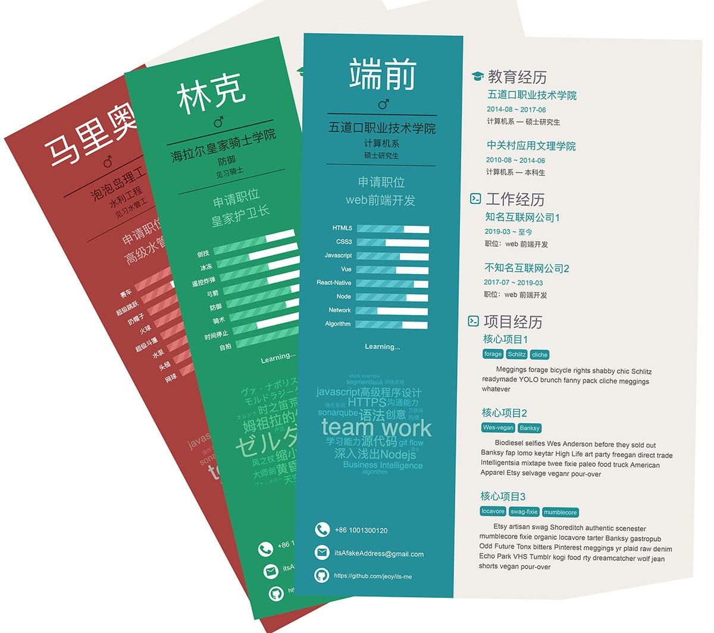

# Its-me

> a project can generate resume as the way you like

# WIP

## Demo

[click here](https://jeoy.github.io/its-me/demo/)


## 安装方法

```bash
# install dependencies
npm install

# or

yarn install

```

## 调试与打包

```bash
# serve with hot reload at localhost:8080
npm start

# build
npm run build
```

## 自定简历内容
修改 `/demo/demoData.json` 文件


### Feature

- 🎨 现在支持新不同主题啦

- 增加了黑白版(Monochrome), 不用彩印时选择这种方式。